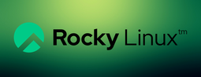

# Características de Rocky Linux

1. **Proyecto comunitario:** Rocky Linux es un proyecto impulsado por la comunidad, similar a cómo CentOS comenzó originalmente. Está respaldado por la comunidad y organizaciones interesadas en ofrecer una distribución de Linux estable y de largo plazo.

2. **Para empresas:** Al igual que Red Hat y CentOS, Rocky Linux está diseñado para su uso en entornos empresariales y servidores. Ofrece estabilidad y un ciclo de vida de soporte extendido.

3. **Licencia de código abierto:** Rocky Linux se distribuye bajo licencias de código abierto, lo que significa que su código fuente está disponible para la inspección y modificación, cumpliendo con los principios fundamentales del software libre.

4. **Actualizaciones y Parches:** Rocky Linux proporciona actualizaciones y parches de seguridad para garantizar un entorno seguro y confiable para los usuarios. Proveyendo hasta 10 años de soporte y actualizaciones regulares sin costo

5. **Herramientas de gestión de paquetes:** Utiliza el formato de paquete RPM (Red Hat Package Manager) para la gestión de paquetes, similar a otras distribuciones basadas en Red Hat.

6. **Seguridad:** Al igual que Red Hat, Rocky Linux pone un énfasis especial en la seguridad y proporciona herramientas y prácticas recomendadas para garantizar la protección del sistema.

7. **Apoyado por la comunidad:** Rocky Linux cuenta con el apoyo y la participación activa de una comunidad de usuarios, desarrolladores y administradores de sistemas. Esto contribuye a la mejora continua y al soporte mutuo entre los usuarios.
